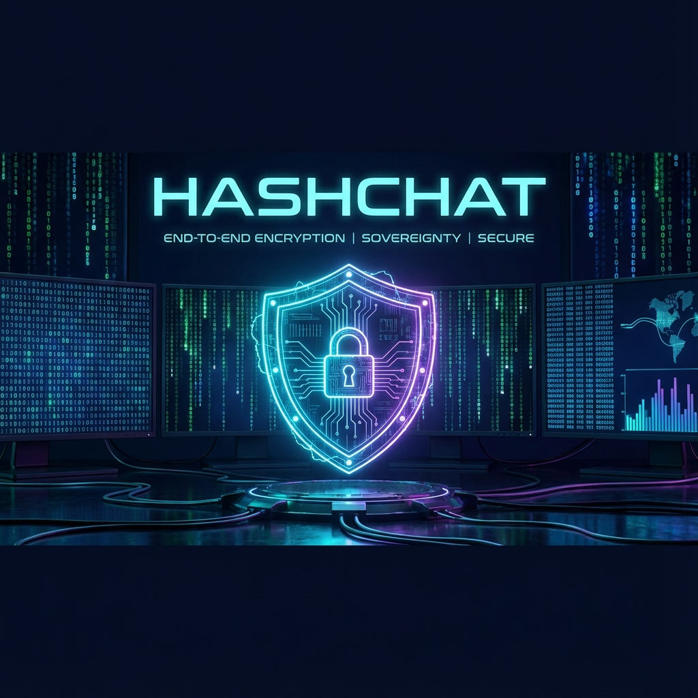
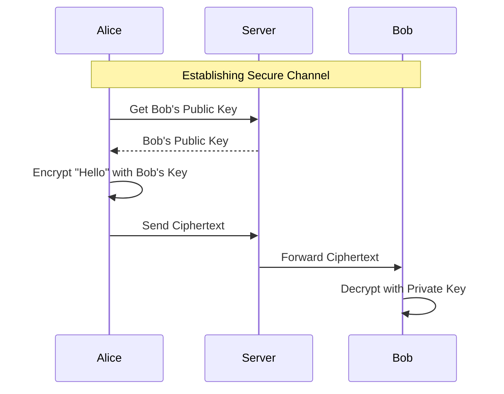

# 🦅 Hashchat: The Elite Cryptographic Command Center

> **"Privacy is not a privilege, it is a mathematical certainty."**

<div align="center">
  
  <br/>
  <br/>
  <a href="https://github.com/bahattinyunus/Hashchat/blob/main/LICENSE"></a>
  <a href="https://github.com/bahattinyunus/Hashchat/actions"></a>
  <a href="https://swift.org"></a>
  <a href="https://python.org"></a>
  <br/>
  <br/>
</div>

## 📚 Table of Contents
1. [Introduction](#-introduction)
2. [What is Hashchat?](#-what-is-hashchat)
3. [The Cryptography Curriculum](#-the-cryptography-curriculum)
    - [Symmetric Ciphers](#symmetric-ciphers-the-classics)
    - [Asymmetric Power (RSA)](#asymmetric-power-e2ee)
4. [Hashchat 2.0 Architecture](#-hashchat-20-architecture)
    - [Ironclad Persistence](#ironclad-persistence-sqlite)
    - [Elite Intelligence (Loguru)](#elite-intelligence-logging)
5. [Installation & Deployment](#-installation--deployment)
6. [Contributing](#-contributing)

---

## 🚀 Introduction

Welcome to **Hashchat**, a state-of-the-art educational platform disguised as a messaging app. We didn't just build a chat app; we built a **Digital Laboratory** for mastering the art of cryptography.

Whether you are a student, a security researcher, or a privacy privacy enthusiast, Hashchat allows you to **visualize** and **experiment** with the mathematical engines that secure the modern internet.

## 📱 What is Hashchat?

Hashchat is a dual-stack graphical application:
- **Frontend (iOS/Swift)**: A beautiful, modern interface for composing encrypted messages.
- **Backend (Python/FastAPI)**: A robust, zero-knowledge relay server that connects users without ever seeing their raw data.
- **Protocol**: Real-time **WebSockets** for instant communication.

### 🌟 Key Features
- **Manual Cipher Implementations**: We wrote AES and DES from scratch (S-Boxes, Permutations) so you can read the code and learn how they work bit-by-bit.
- **Hybrid Cryptography**: Combine classical ciphers (Caesar, Vigenère) with military-grade algorithms (AES-128, RSA-2048).
- **End-to-End Encryption (E2EE)**: Messages are encrypted on your device and only decrypted on the recipient's device. The server sees nothing but noise.

---

## 🎓 The Cryptography Curriculum

Hashchat is designed to teach. Here is your syllabus:

### Symmetric Ciphers (The Classics)
In symmetric encryption, the **same key** is used to lock and unlock the message.
- **Caesar Cipher**: Shifting the alphabet. The "Hello World" of crypto.
- **Vigenère**: Polyalphabetic substitution. The "Unbreakable Cipher" of the 19th century.
- **AES (Advanced Encryption Standard)**: The gold standard. Included as a pure Swift implementation to study the `ShiftRows`, `SubBytes`, and `MixColumns` operations.

### Asymmetric Power (E2EE)
How do two people share a secret key without meeting? Enter **RSA**.

#### The Handshake Protocol 🤝
1. **Key Generation**: When you install Hashchat, your device generates a **Public Key** (shareable) and a **Private Key** (secret).
2. **Registration**: Your Public Key is sent to the Hashchat Server.
3. **Transmission**:
   - Alice wants to message Bob.
   - Hashchat fetches Bob's **Public Key**.
   - Hashchat encrypts the message with Bob's Public Key.
4. **Decryption**: Only Bob's **Private Key** can unlock the message.



---

## 🏗️ Hashchat 2.0 Architecture

With the release of **Hashchat 2.0**, we have upgraded the system to professional standards.

### Ironclad Persistence (SQLite) 💾
Your identity is now permanent.
- **Technology**: **SQLAlchemy** ORM + **SQLite**.
- **Benefit**: User accounts and public keys persist across server restarts. The database file `hashchat.db` serves as the single source of truth.

### Elite Intelligence (Logging) 🧠
Monitoring is key to defense.
- **Technology**: **Loguru**.
- **Benefit**: High-performance, structured logging. Every event—registration, message relay, error—is captured with timestamp and severity level.
- **Visuals**: Color-coded console output for instant anomaly detection.

### CI/CD Pipeline ⚙️
Code quality is enforced automatically.
- **GitHub Actions**: Every commit triggers a suite of backend tests (`pytest`).
- **Safety**: No broken code reaches the `main` branch.

---

## 🛠️ Installation & Deployment

### 1. Backend (The Nervous System)
The brain of the operation. Runs on Python 3.11+.

```bash
# Clone the repo
git clone https://github.com/bahattinyunus/Hashchat.git
cd Hashchat/Hashchat/Backend

# Install dependencies
pip install -r requirements.txt

# Launch the Elite Server
uvicorn main:app --reload
```
*You will see the database initialize and the logs start flowing.*

### 2. Frontend (The Interface)
The face of the operation. Requires macOS + Xcode.

1. Open `Hashchat/Hashchat/Frontend/Hashchat.xcodeproj` in Xcode.
2. Select your simulator context (e.g., iPhone 15 Pro).
3. Press **Cmd + R** to build and run.
4. *Optional*: Run two simulators to chat with yourself!

---

## 🤝 Contributing

We welcome all operatives. Whether you want to add a new cipher (maybe **ChaCha20**?) or improve the UI:
1. Read [CONTRIBUTING.md](CONTRIBUTING.md).
2. Follow the [CODE_OF_CONDUCT.md](CODE_OF_CONDUCT.md).
3. Open a Pull Request.

---

### 📜 License
This project is licensed under the Apache 2.0 License - see the [LICENSE](LICENSE) file for details.

> **"We build the tools of freedom."** - Hashchat Team
