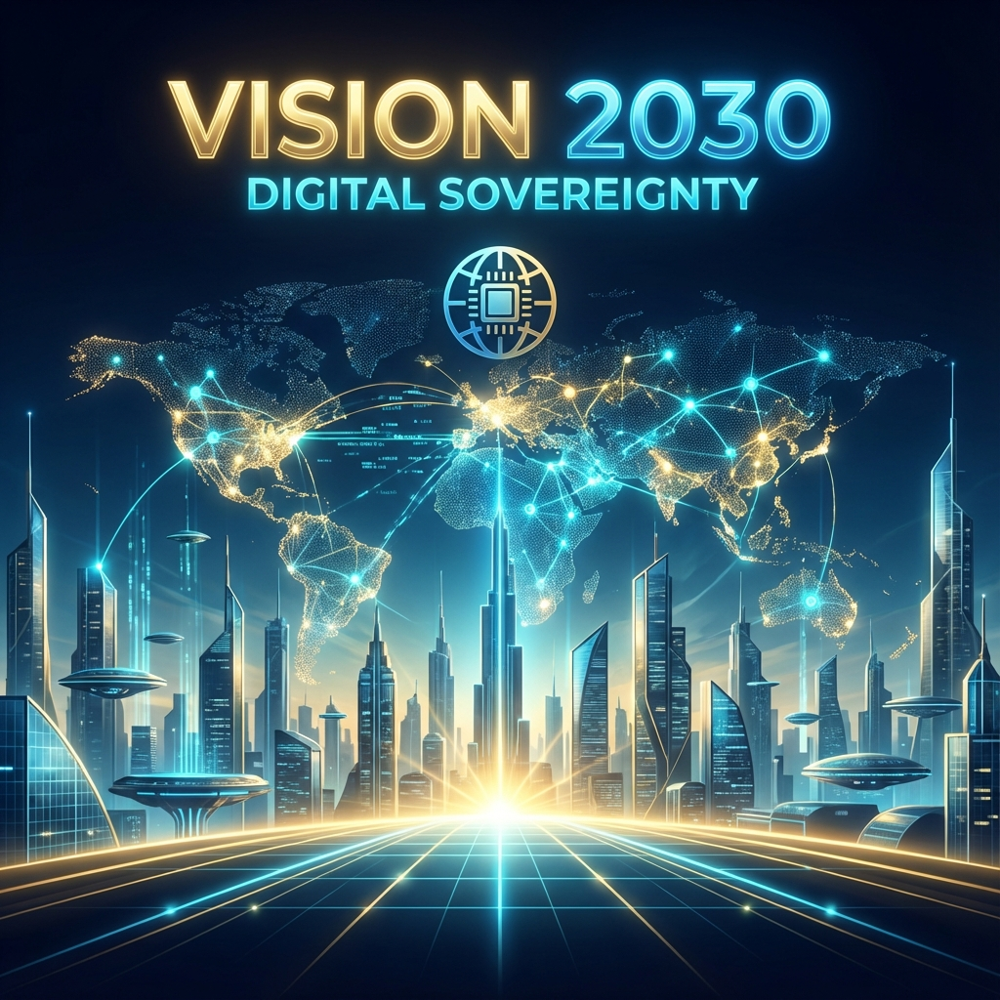

  
  
   
   

  <h1>🌐 VİZYON 2030: SİBER EGEMENLİK MANİFESTOSU</h1>
  <h3><i>"Geleceği tahmin etmenin en iyi yolu, onu şifrelemektir."</i></h3>

---

## 🏛️ I. DİJİTAL ANAYASA (THE DIGITAL CONSTITUTION)

Biz, **Hashchat Geliştirici Kolektifi** olarak, dijital mahremiyetin bir "lüks" değil, temel bir **insan hakkı** olduğuna inanıyoruz.

İçinde yaşadığımız çağda verilerimiz, şirketler tarafından satılan birer "emtia" (mal) haline gelmiştir. Sohbetlerimiz taranmakta, konumumuz izlenmekte, dijital kimliğimiz profillenmektedir. Hashchat, bu distopik geleceğe karşı inşa edilmiş bir **Direniş Kalesidir**.

### Temel İlkelerimiz:
1.  **Sıfır Güven (Zero Trust):** Hiçbir sunucuya, hiçbir şirkete, hiçbir otoriteye güvenme. Sadece matematiğe güven.
2.  **Sıfır Bilgi (Zero Knowledge):** Sistem, kullanıcı hakkında hiçbir şey bilmemelidir. Kimin konuştuğunu, ne konuştuğunu, ne zaman konuştuğunu bilemez.
3.  **Kalıcı Egemenlik (Sovereignty):** Kullanıcı, kendi kriptografik anahtarlarının (Private Keys) tek sahibi ve efendisidir.

---

## 🔮 II. STRATEJİK SÜTUNLAR (THE PILLARS)

### 1. Kuantum Dirençli Savunma (Post-Quantum Cryptography) 🛡️
Kuantum bilgisayarların yükselişi (Q-Day), bugünkü şifreleme yöntemlerini (RSA, ECC) kağıt gibi yırtıp atacaktır. Hashchat, bu kaçınılmaz geleceğe şimdiden hazırlanıyor.
*   **Tehdit:** "Şimdi Kaydet, Sonra Çöz" (Harvest Now, Decrypt Later) saldırıları. Bugünün şifreli mesajları, 10 yıl sonra kuantum bilgisayarlarla çözülmek üzere arşivleniyor.
*   **Çözüm:** Hashchat 3.0 ile birlikte **NIST Crystals-Kyber** ve **Dilithium** gibi Kafes Tabanlı (Lattice-based) şifreleme algoritmalarına geçiş yapacağız. Hedefimiz, mesajlarınızın 2050 yılında bile güvende kalmasıdır.

### 2. Merkeziyetsiz Mesh Ağı (Decentralized Nexus) 🕸️
Şu anki mimarimiz güvenlidir ancak hala merkezi bir röle sunucusuna ihtiyaç duyar. Gerçek özgürlük, merkezsizliktir.
*   **Hedef:** Sunucuyu tamamen ortadan kaldırmak.
*   **Yöntem:** Cihazların (Telefonların) birbirine doğrudan bağlandığı, verinin cihazdan cihaza (Peer-to-Peer) aktığı, bloklanamaz ve sansürlenemez bir **Hashchat Mesh Ağı** kurmak. İnternet kesilse bile, Bluetooth ve Wi-Fi köprüleri üzerinden yerel iletişim devam edecek.

### 3. Kriptografik Okuryazarlık Seferberliği 🧠
En güvenli sistem bile, eğitimsiz bir kullanıcı tarafından kullanıldığında zayıftır.
*   **Vizyon:** Hashchat uygulamasını, sadece bir "sohbet aracı" olmaktan çıkarıp, interaktif bir "Kriptografi Okulu"na dönüştürmek. Kullanıcılar, arka planda çalışan algoritmaları (AES, Diffie-Hellman) oyunlaştırılmış modüllerle öğrenecek.
*   **Amaç:** Toplumu, dijital çağın okuma-yazması olan "şifreleme" konusunda eğitmek.

---

## 🗺️ BÜYÜK YOL HARİTASI (ROADMAP TO 2030)

Bu plan, Hashchat'in önümüzdeki 5 yıl içindeki evrimini göstermektedir.

### � Faz 1: Temelin Atılması (2024 - 2025)
*   [x] **Hashchat V1.0:** Prototip sürüm. (Tamamlandı)
*   [x] **Hashchat V2.0:** "Elite" Sürüm. Persistence (SQLAlchemy), Loglama (Loguru) ve Ansiklopedik Dokümantasyon. (Tamamlandı - ŞU AN)
*   [ ] **Görsel Eğitim Modülleri:** Uygulama içinde AES döngülerinin animasyonla gösterilmesi.

### 🚩 Faz 2: Genişleme (2025 - 2026)
*   **Çoklu Cihaz Desteği (Multi-Device):** Telefon ve bilgisayar arasında güvenli senkronizasyon.
*   **Grup Sohbetleri:** "Signal Protokolü" benzeri (Double Ratchet) ileri seviye grup şifrelemesi.
*   **Anonim Kimlikler:** Telefon numarası veya E-posta zorunluluğunun tamamen kaldırılması. Sadece Public Key = Kimlik.

### 🚩 Faz 3: Kuantum Sıçraması (2027 - 2028)
*   **Entegrasyon:** Hibrit Kriptografi (Klasik RSA + Kuantum Sonrası Algoritmalar).
*   **Dış Denetim (Audit):** Kodun uluslararası güvenlik firmaları tarafından denetlenmesi ve sertifikalandırılması.

### 🚩 Faz 4: Mutlak Egemenlik (2030 ve Ötesi)
*   **The Nexus (Mesh Ağı):** Merkezi sunucunun emekliye ayrılması. Hashchat'in kendi kendine yeten, durdurulamaz bir küresel ağ haline gelmesi.
*   **Donanım:** Hashchat için özel, hacklenemez donanım cüzdanları (Hardware Wallets) entegrasyonu.

---

*Bu belge, kuzey yıldızımızdır. Teknolojiler değişebilir, diller değişebilir, ancak mahremiyet vizyonumuz asla değişmeyecektir.*

  <b>Gelecek, onu bugünden inşa edenlerin olacaktır.</b>

